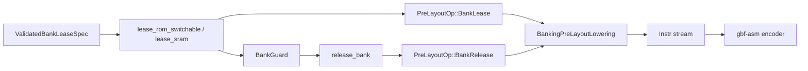
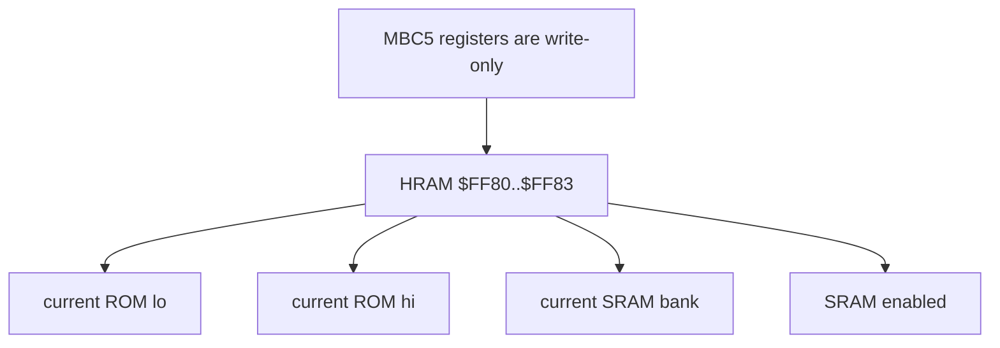

# F-A4 Diagrams

## Authoring To Bytes

```mermaid
flowchart LR
    A["ValidatedBankLeaseSpec"] --> B["lease_rom_switchable / lease_sram"]
    B --> C["BankGuard"]
    C --> D["release_bank"]
    B --> E["PreLayoutOp::BankLease"]
    D --> F["PreLayoutOp::BankRelease"]
    E --> G["BankingPreLayoutLowering"]
    F --> G
    G --> H["Instr stream"]
    H --> I["gbf-asm encoder"]
```

## Shadow Ownership

```mermaid
flowchart TB
    R["MBC5 registers are write-only"] --> S["HRAM $FF80..$FF83"]
    S --> A["current ROM lo"]
    S --> B["current ROM hi"]
    S --> C["current SRAM bank"]
    S --> D["SRAM enabled"]
```

