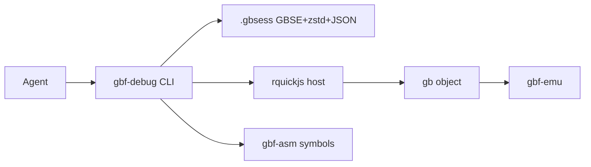

```mermaid
flowchart LR
  Agent --> CLI[gbf-debug CLI]
  CLI --> Session[.gbsess GBSE+zstd+JSON]
  CLI --> JS[rquickjs host]
  JS --> GB[gb object]
  GB --> Emu[gbf-emu]
  CLI --> ASM[gbf-asm symbols]
```

The `.gbsess` byte layout is `GBSE` magic, four zero flag bytes, then a zstd-compressed JSON `Session`.
