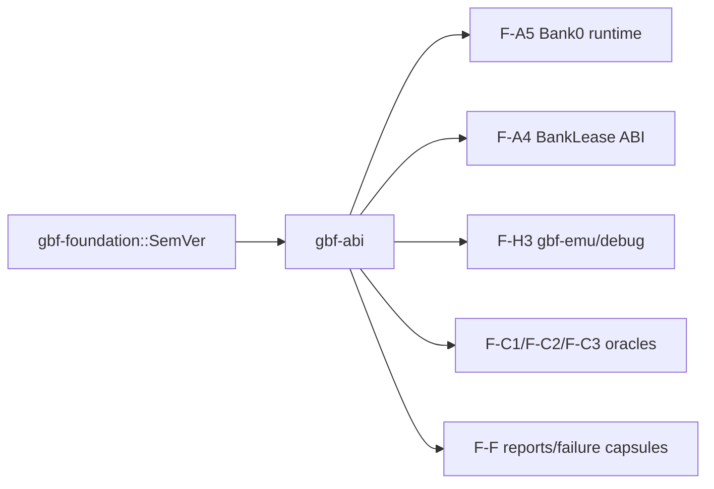
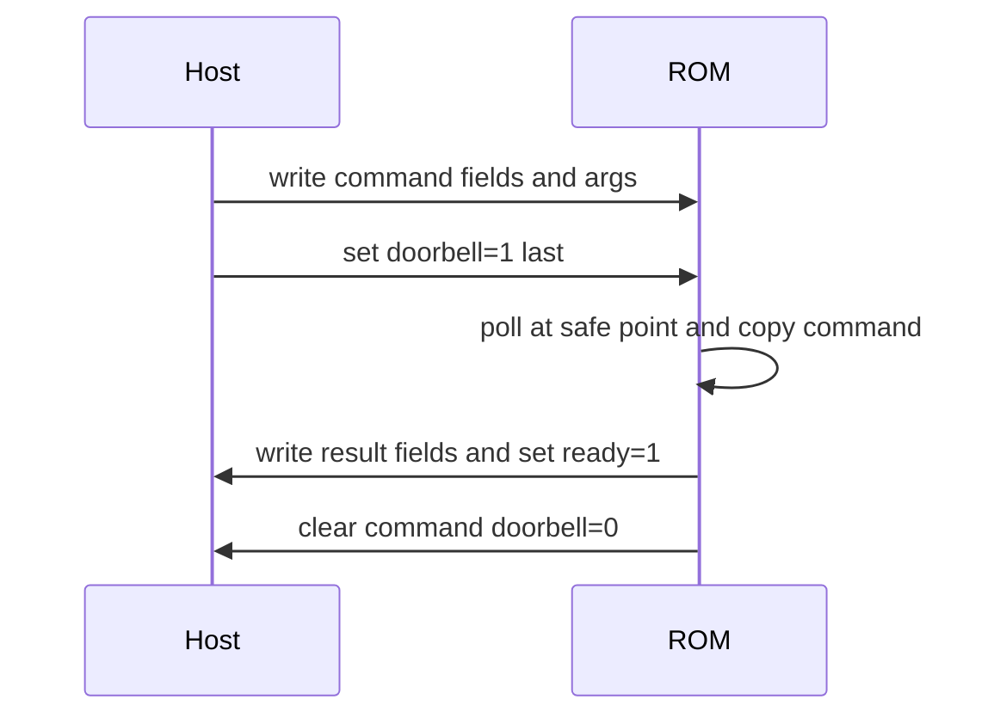
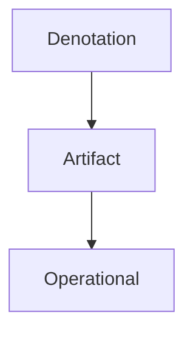

# F-A3 Review Packet: gbf-abi

## Orientation

This packet pre-digests RFC `history/rfcs/F-A3-gbf-abi.md` for feature bead `bd-2k2` and child beads `bd-2ul`, `bd-2qx`, `bd-2m8`, `bd-1si`, `bd-30s`, `bd-1ml`, and `bd-34v`.

Recommended pass order:

1. Read the scope and non-goals below.
2. Check `layout-report.json` against the `repr(C)` source definitions and targeted layout tests.
3. Read `claim-to-gate.md` to map every load-bearing claim to tests.
4. Inspect `dependency-report.md` for the no-upward-dependency invariant.
5. Use `reviewer-checklist.md` as the final approval pass.

## Scope Ledger

In scope:

- `AbiVersion`, host `CompatibilityEnvelope`, and 152-byte `BuildIdentityBlock`.
- `InferenceStateHeader`, `FaultCodeOptional`, and `LivenessCounters`.
- `HarnessCommandBlock` / `HarnessResultBlock` with raw discriminant decoding.
- `FaultCode`, `FaultDomain`, `FaultSnapshot`, host `FaultPolicy`, and `BootValidationPlan`.
- `InterruptPolicy`, `ResourceLeaseKind`, and `ResourceLease` validation/report vocabulary.
- `SemanticCheckpointId`, `CompactCheckpointId`, `SemanticCheckpointSchema`, and `CheckpointResolver`.
- `TraceEvent`, trace budget/drop policy, and host `TraceProbeRegistry`.
- Targeted layout tests, serde round trips, deterministic property tests, negative discriminant/magic/reserved tests, and no local unsafe.

Out of scope and owners:

- Runtime persistence protocol: F-D1/T-A6.x. F-A3 guard: only identity/fault field shapes exist here.
- Full BankLease/BankGuard runtime API: F-A4. F-A3 guard: `ResourceLeaseKind` is vocabulary, not a call ABI.
- Semantic checkpoint schema production: F-F1/gbf-codegen. F-A3 guard: schema validates and resolves; it does not mint ids.
- Trace transport and payload schemas: F-D3. F-A3 guard: `TraceEvent` has fixed bytes; payload tags are named only.
- Emulator glue: F-H3. F-A3 guard: explicit parsers/layouts, no memory casting helpers.
- Schema migration: F-A6. F-A3 guard: versions and validation errors are typed, migration DAG absent.

## Reading Guide

- Layout pass: `version.rs`, `liveness.rs`, `continuation.rs`, `fault.rs`, `harness.rs`, `trace.rs`; compare with `layout-report.json`.
- Enum pass: `FaultCode`, `FaultDomain`, `HarnessOp`, `HarnessResultKind`, `ProbeLevel`, `ProbeBudgetClass`, `TraceDropPolicy`, `InterruptPolicy`, `RecoveryAction`, `SemanticStratum`.
- Liveness pass: `LivenessCounters::record_progress`, `note_idle_frame`, `is_livelocked`, and `InferenceStateHeader::validate`.
- Checkpoint pass: `SemanticCheckpointId` parser and `SemanticCheckpointSchema::validate`.
- Harness/trace pass: raw `u16` op/kind fields and `TraceEvent` slot layout.
- Host surface pass: cfg-gated `CompatibilityEnvelope`, `FaultPolicy`, checkpoint schema, and trace registry.

## Diff Map

| File | Risk | Why reviewers should care | Primary gates |
| --- | --- | --- | --- |
| AGENTS.md | Low | Adds Gemini --skip-trust review rule requested during F-A3. | n/a |
| gbf-abi/Cargo.toml | Medium | Defines host/alloc/std features and keeps serde no-default for ABI builds. | cargo check/test feature matrix |
| gbf-abi/src/version.rs | High | ABI version and ROM build identity handshake. | version::* |
| gbf-abi/src/checkpoint.rs | High | Durable semantic ids and build-local compact schema. | checkpoint::* |
| gbf-abi/src/continuation.rs | High | 32-byte continuation prefix and opaque tail helpers. | continuation::* |
| gbf-abi/src/liveness.rs | High | Non-optional liveness state and saturation semantics. | liveness::* |
| gbf-abi/src/fault.rs | High | Pinned fault ranges, snapshots, and host recovery policy. | fault::* |
| gbf-abi/src/interrupt.rs | Medium | Lease/interrupt validation vocabulary for F-A4/F-B11. | interrupt::* |
| gbf-abi/src/harness.rs | High | Bidirectional harness control-plane blocks. | harness::* |
| gbf-abi/src/trace.rs | High | 32-byte trace events, budgets, and probe registry shell. | trace::* |
| gbf-abi/tests/property.rs | Medium | Deterministic RFC property tests for byte round trips, liveness, and checkpoint resolution. | property::* |
| scripts/generate_f_a3_review_packet.py | Medium | Single-command packet regeneration/staleness gate. | python3 scripts/generate_f_a3_review_packet.py --check |

## Architecture Diagrams

### Crate Relationship



### BuildIdentityBlock Bytes

```text
0..4 magic | 4..7 abi | 7 reserved | 8..136 four hashes | 136..144 timestamp | 144..152 tail/schema/reserved
```

### InferenceStateHeader Bytes

```text
0..4 abi/reserved | 4..8 schema/last_fault | 8..20 session/token/slice | 20..32 liveness
```

### Harness Doorbell



### Fault Partition

```text
0x0000 None; 0x0001..0x000F Boot; 0x0010..0x001F Persistence; 0x0020..0x002F Banking;
0x0030..0x0031 Scheduling; 0x0032..0x003F Liveness; 0x0040..0x004F UI;
0x0050..0x005F Schema; 0x0060..0x006F Harness; 0x0070..0x007F Trace;
0x0080..0x008F Calibration; 0xFF00..0xFFFF Internal.
```

### Checkpoint Strata



## Correctness Dossier

- `layout-report.json` pins the expected size, alignment, and field offsets for review; source keeps targeted runtime layout tests.
- Byte parsers are explicit little-endian helpers; `gbf-abi` does not expose transmute/bytemuck casting.
- Raw enum fields in memory blocks are stored as `u16` and decoded through `from_u16`; unknown values become typed errors.
- `SemanticCheckpointId` permits only non-empty dotted `[a-z0-9_]+` segments up to 128 bytes.
- `SemanticCheckpointSchema` rejects schema version zero, duplicate semantic ids, duplicate compact ids, and `CompactCheckpointId::NONE`.
- `LivenessCounters` uses saturating epoch/frame arithmetic; threshold zero disables timeout; equality triggers livelock.
- Constructors stamp magic, zero reserved bytes, and stage harness signal bytes clear; validators reject bad magic, nonzero reserved bytes, and invalid harness signal values.

## Test Coverage Report

Run:

```bash
cargo test -p gbf-abi --no-default-features
cargo test -p gbf-abi --no-default-features --features alloc
cargo test -p gbf-abi --features host
cargo clippy -p gbf-abi --all-features -- -D warnings
python3 scripts/generate_f_a3_review_packet.py --check
```

The test names intentionally mirror the RFC acceptance gates so filtered runs remain meaningful.

## Reproducibility Report

Packet regeneration command:

```bash
python3 scripts/generate_f_a3_review_packet.py
```

Staleness check:

```bash
python3 scripts/generate_f_a3_review_packet.py --check
```

Toolchain captured during generation:

```text
rustc 1.94.1 (e408947bf 2026-03-25)
binary: rustc
commit-hash: e408947bfd200af42db322daf0fadfe7e26d3bd1
commit-date: 2026-03-25
host: aarch64-apple-darwin
release: 1.94.1
LLVM version: 21.1.8
cargo 1.94.1 (29ea6fb6a 2026-03-24)
```

`BuildIdentityBlock::timestamp_unix` is caller-provided; reproducible builds feed it from `SOURCE_DATE_EPOCH` or use `0` in deterministic mode. The ABI crate itself never reads wall-clock time.

## Generated Artifacts

- `README.md`: human review guide and mandatory content ledger.
- `layout-report.json`: byte layout evidence for every `repr(C)` ABI type.
- `claim-to-gate.md`: RFC claim-to-test mapping.
- `dependency-report.md`: dependency tree, feature notes, and no-upward-dependency evidence.
- `reviewer-checklist.md`: final approval checklist.

## Known Debt

No TODO/FIXME debt is introduced in `gbf-abi`. Deferred production paths are listed in the scope ledger with owning feature beads.

## API Guide

- Bare/no-default: fixed ABI layouts, enums, ids, liveness, harness blocks, trace events, interrupt/lease vocabulary.
- `alloc`: adds validated `SemanticCheckpointId`.
- `host`: adds compatibility envelope, checkpoint schema/resolver, fault policy, and trace probe registry.

## Error Shape Report

- `AbiVersionError`: zero, unsupported, or semver out of u8 range.
- `BuildIdentityError`: bad magic, bad ABI, truncated bytes, nonzero reserved bytes, bad schema version.
- `ContinuationError`: truncated header/tail, size overflow, bad ABI/schema, unknown last fault, nonzero reserved byte.
- `HarnessProtocolError`: bad magic, nonzero reserved byte, unknown op/result kind, sequence mismatch.
- `SnapshotDecodeError`: unknown fault code/domain, domain mismatch, nonzero reserved byte.
- `CheckpointIdError`: empty, too long, invalid char, leading/trailing/double dot.
- `SchemaValidationError`: duplicate/reserved ids, identity hash/version mismatch.
- `FaultPolicyError`: illegal default action.
- `TraceBudgetError`: inconsistent zero/nonzero budget settings.
- `TraceProbeRegistryError`: duplicate probe or identity mismatch.

## Source-To-Artifact Traceability

This file and sibling artifacts are produced by `scripts/generate_f_a3_review_packet.py`. Layout constants in the script mirror the RFC/source ABI contract; stale artifacts fail with `--check`.
