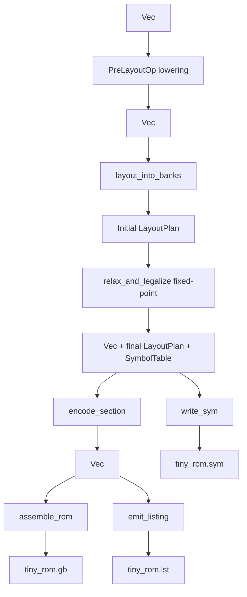
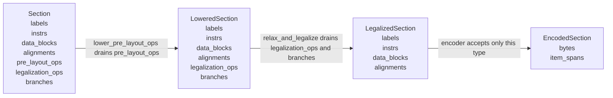
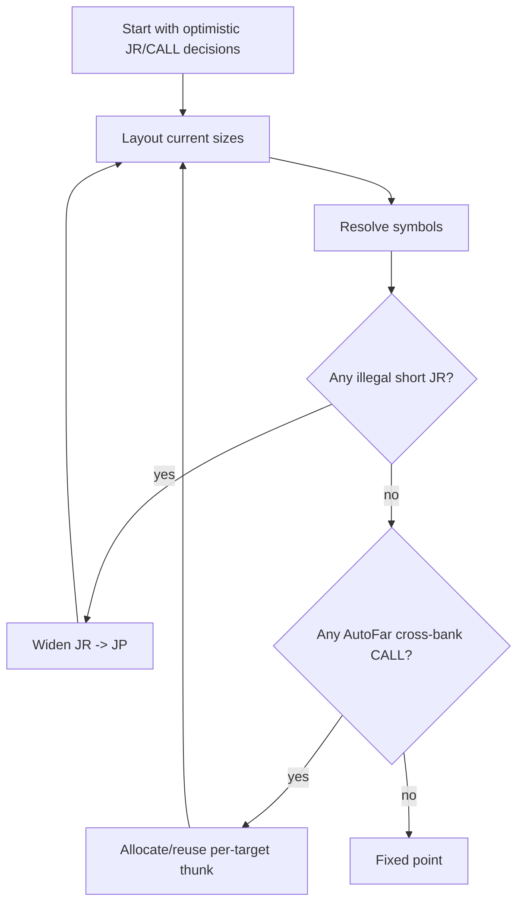
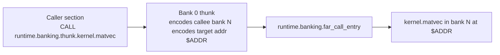
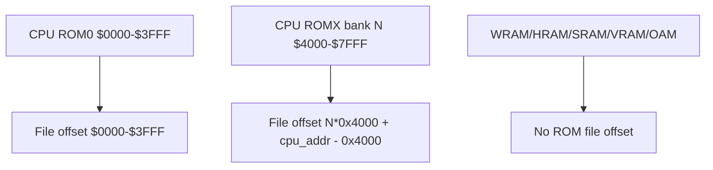

A comprehensive F-A1 review packet should be a **first-class artifact** checked into the PR, not an informal note. Its job is to let a reviewer answer four questions quickly:

1. **Is the implementation correct?**
2. **Is the implementation clear and maintainable?**
3. **Are the riskiest invariants actually proved by tests, types, or generated artifacts?**
4. **Can I reproduce every claimed output locally?**

I would require the packet to live under something like:

```text
docs/review/f-a1/
  README.md
  scope.md
  review-order.md
  diff-map.md
  architecture.md
  correctness-dossier.md
  claim-to-gate.md
  test-coverage.md
  reproducibility.md
  benchmarks.md
  generated-artifacts.md
  dependencies.md
  known-debt.md
  out-of-scope.md
  reviewer-checklist.md
  diagrams/
    pipeline.mmd
    pipeline.svg
    type-state.mmd
    type-state.svg
    relax-fixed-point.mmd
    relax-fixed-point.svg
    far-call-thunk.mmd
    far-call-thunk.svg
    rom-address-map.mmd
    rom-address-map.svg
  videos/
    00-index.md
    01-pipeline-walkthrough.mp4
    01-pipeline-walkthrough.transcript.md
    02-encoder-cycle-model.mp4
    02-encoder-cycle-model.transcript.md
    03-layout-relax-debug.mp4
    03-layout-relax-debug.transcript.md
    04-tiny-rom-repro.mp4
    04-tiny-rom-repro.transcript.md
  artifacts/
    tiny_rom.gb
    tiny_rom.lst
    tiny_rom.sym
    tiny_rom.sha256
    test-output.txt
    bench-output.txt
    cargo-tree.txt
    cargo-deny.txt
    coverage-summary.txt
scripts/review/f-a1/
  build-packet.sh
  verify-packet.sh
  clean-packet.sh
```

The most important rule: **the packet should be reproducible**. A reviewer should be able to run one command, rebuild the examples and reports, and confirm that the checked-in artifacts match.

```bash
./scripts/review/f-a1/verify-packet.sh
```

That script should run the relevant tests, rebuild `tiny_rom.gb`, regenerate `.lst` and `.sym`, recompute hashes, optionally regenerate diagrams, and fail loudly if any claimed artifact is stale.

---

# 1. Packet README

`docs/review/f-a1/README.md` should be the reviewer’s landing page.

It should contain:

```text
RFC: F-A1 — gbf-asm, completing the typed LR35902 eDSL
Branch:
Commit:
Engineer:
PRs included:
  - PR 1: cycle_model + encoder
  - PR 2: layout + relax + lowering
  - PR 3: listing + rom + tiny_rom
Closed tasks:
  - T-A1.5 cycle model
  - T-A1.6 layout / relax
  - T-A1.7 encoder
  - T-A1.8 listing
  - T-A1.9 ROM builder
Still deferred:
  - emulator-driven boot validation
  - production BankLease ABI
  - F-A5 text renderer
  - Epic B reachability validation
```

It should also have a **one-page executive summary**:

```text
This implementation completes the gbf-asm pipeline:

Vec<Section>
  -> LoweredSection
  -> LayoutPlan
  -> LegalizedSection
  -> EncodedSection
  -> .gb / .lst / .sym

The highest-risk implementation points are:

1. Encoder opcode correctness.
2. LegalizedSection type-state boundary.
3. Branch relaxation fixed-point behavior.
4. Cross-bank CALL thunk rewriting.
5. ROM header/checksum correctness.
6. Determinism of .gb/.lst/.sym output.
7. No hidden raw-byte or unlegalized-op escape hatch.
```

It should include **the exact reviewer command set**:

```bash
cargo test -p gbf-asm --all-features
cargo test --workspace --all-features
cargo run -p gbf-asm --example tiny_rom --features stub-runtime
./scripts/review/f-a1/verify-packet.sh
```

And it should include the expected high-level output shape:

```text
Expected generated artifacts:

target/review/f-a1/tiny_rom.gb   32768 bytes
target/review/f-a1/tiny_rom.lst  deterministic text listing
target/review/f-a1/tiny_rom.sym  deterministic symbol table

Expected hashes:
  tiny_rom.gb   <sha256>
  tiny_rom.lst  <sha256>
  tiny_rom.sym  <sha256>
```

The engineer should fill in actual hashes at implementation time.

---

# 2. Scope document

`scope.md` should separate **implemented**, **intentionally deferred**, and **explicitly not claimed** work.

For F-A1, it should say:

## In scope

* `cycle_model.rs`
* `encoder.rs`
* `layout.rs`
* `relax.rs`
* `lowering.rs`
* `listing.rs`
* `rom.rs`
* `.sym` writer additions in `symbols.rs`
* `tiny_rom` example
* deterministic `.gb`, `.lst`, `.sym` generation
* structural ROM validation
* typed lowering and legalization boundaries
* fixed-point branch relaxation
* stub runtime lowering behind feature gate

## Out of scope

* live emulator boot test
* gameroy integration
* `gbf-debug`
* production F-A4 `BankLease` / `BankGuard` runtime ABI
* F-A5 text renderer
* Epic B reachability validation
* hotness-driven placement
* bank-switch coalescing
* stage cache integration
* no-std migration
* CGB / GBC features

Each deferred item should include:

```text
Deferred item:
Why not in F-A1:
Which feature owns it:
What test prevents accidental dependence in F-A1:
```

Example:

```text
Deferred item: emulator-driven boot validation
Why not in F-A1: owned by gbf-emu / gbf-debug follow-up
Owner: follow-up M0 feature
F-A1 guard: tiny_rom structural tests validate header, checksums, layout, .sym, listing, and deterministic bytes; no test claims emulator execution.
```

---

# 3. Review order guide

`review-order.md` is one of the most important files. It should tell the reviewer exactly where to start, what to read deeply, what to skim, and what can be ignored.

A good F-A1 review order would be:

## Pass 0 — sanity and reproduction

Read:

```text
docs/review/f-a1/README.md
docs/review/f-a1/reproducibility.md
docs/review/f-a1/generated-artifacts.md
```

Run:

```bash
./scripts/review/f-a1/verify-packet.sh
```

Goal:

```text
Confirm that tests pass and generated artifacts match the packet.
```

## Pass 1 — type-state and API boundaries

Read deeply:

```text
gbf-asm/src/section.rs
gbf-asm/src/lowering.rs
gbf-asm/src/lib.rs
```

Skim existing context:

```text
gbf-asm/src/builder.rs
gbf-asm/src/effect.rs
gbf-asm/src/symbols.rs
```

Questions to answer:

```text
Does Section -> LoweredSection -> LegalizedSection physically remove arrays that should no longer exist?
Can encoder receive unresolved branches or unlegalized ops?
Are structured ops lowered in the correct phase?
Are external runtime symbols impossible to encode accidentally?
```

## Pass 2 — encoder and cycle model

Read deeply:

```text
gbf-asm/src/encoder.rs
gbf-asm/src/cycle_model.rs
gbf-asm/tests/encoder*.rs
gbf-asm/tests/cycle_model*.rs
```

Questions to answer:

```text
Does every Instr variant encode correctly?
Does encode_instr length always match Instr::byte_len?
Are CB-prefixed instructions exhaustively tested?
Are conditional branch cycle costs correct by family?
Is HALT represented as the canonical one-byte instruction?
```

## Pass 3 — layout and relaxation

Read deeply:

```text
gbf-asm/src/layout.rs
gbf-asm/src/relax.rs
gbf-asm/tests/layout*.rs
gbf-asm/tests/relax*.rs
```

Questions to answer:

```text
Can any section cross a bank boundary?
Are CPU-visible addresses distinguished from ROM file offsets?
Does relaxation only make monotone decisions?
Is the fixed-point cap derived from branch/thunk count?
Are cross-bank JR/JP rejected?
Are cross-bank CALLs rewritten only when AutoFar is requested?
Are far-call thunks per target symbol, not per callee bank?
```

## Pass 4 — ROM builder

Read deeply:

```text
gbf-asm/src/rom.rs
gbf-asm/tests/rom*.rs
gbf-asm/examples/tiny_rom.rs
```

Questions to answer:

```text
Is the internal cartridge header emitted through typed items?
Are user HeaderCartridge sections rejected?
Are Nintendo logo, header checksum, global checksum, ROM size, RAM size, and MBC5 type bytes correct?
Does ROMX bank N CPU $4000 map to file offset N * 0x4000?
Are unused bytes filled with 0xFF?
```

## Pass 5 — listing and symbols

Read deeply:

```text
gbf-asm/src/listing.rs
gbf-asm/src/symbols.rs
gbf-asm/tests/listing*.rs
gbf-asm/tests/symbols*.rs
```

Questions to answer:

```text
Is listing output deterministic?
Are all ListingOptions reflected?
Are item spans consistent with encoded bytes?
Is .sym output sorted?
Is dot-safe escaping injective?
Can external symbols leak into final .sym incorrectly?
```

## Pass 6 — end-to-end behavior

Read:

```text
gbf-asm/tests/determinism.rs
gbf-asm/tests/tiny_rom_snapshot.rs
docs/review/f-a1/artifacts/tiny_rom.lst
docs/review/f-a1/artifacts/tiny_rom.sym
```

Questions to answer:

```text
Does the full pipeline produce byte-stable .gb, .lst, and .sym outputs?
Does the tiny ROM demonstrate layout, relax, encode, ROM header construction, listing, and symbol generation?
Does it avoid claiming live emulator validation?
```

---

# 4. Safe-to-ignore / must-review guide

The packet should explicitly say which files are safe to skip, and under what condition.

## Must review deeply

```text
gbf-asm/src/encoder.rs
gbf-asm/src/cycle_model.rs
gbf-asm/src/layout.rs
gbf-asm/src/relax.rs
gbf-asm/src/lowering.rs
gbf-asm/src/rom.rs
gbf-asm/src/listing.rs
gbf-asm/src/symbols.rs changes
gbf-asm/examples/tiny_rom.rs
```

## Must review at least for API boundary changes

```text
gbf-asm/src/section.rs
gbf-asm/src/builder.rs
gbf-asm/src/effect.rs
gbf-asm/src/lib.rs
gbf-asm/Cargo.toml
```

## Can usually skim

```text
Rendered SVG diagrams
```

Condition:

```text
Only skim rendered SVGs if the corresponding Mermaid source was reviewed and verify-packet.sh regenerated the SVGs successfully.
```

```text
Golden .lst and .sym files
```

Condition:

```text
Review the first version carefully. Later updates can be verified by hash plus focused diff.
```

```text
tiny_rom.gb binary
```

Condition:

```text
Do not line-review the binary. Review the generated hexdump summary, header field table, and SHA-256 reproducibility report.
```

```text
Cargo.lock
```

Condition:

```text
Skim only changed dependency subtrees, then rely on dependencies.md, cargo tree, and cargo deny output.
```

## Not safe to ignore

```text
Opcode tables and CB-prefix encoding logic
Relative branch offset computation
ROMX file offset computation
Header checksum and global checksum code
Alignment padding handoff from layout to encoder
Symbol dot-safe escaping
Thunk naming and per-target deduplication
Stub runtime feature gating
Any code path that can emit bytes without Instr/DataBlock/Align
```

---

# 5. Diff map

`diff-map.md` should be a table mapping every changed file to its purpose, risk level, and relevant tests.

The packet must also include a **Changed File Disposition** table for the
exact PR diff. This table is different from architectural base context:

```text
## Changed File Disposition

| File | Reviewer handling |
| --- | --- |
| `gbf-asm/src/layout.rs` | Deep review; primary PR implementation file. |
| `docs/review/f-a1/pr2-layout-relax-lowering.md` | Read first; packet instructions. |
| `.beads/issues.jsonl` | Skip line review; issue-tracker export only. |
```

Rules:

* Every file in `gh pr diff --name-only <pr>` must appear exactly once in the
  table.
* Files that are useful base context but are not in the PR diff belong in a
  separate "Base Context" or "Reviewer Order" section, not in Changed File
  Disposition.
* The table must tell the reviewer whether to read deeply, skim, or skip line
  review, and why.
* Before requesting review, run:

```bash
python3 scripts/review_packet_check.py \
  --packet docs/review/f-a1/<packet>.md \
  --pr <number>
```

Example:

| File             |             Change |       Risk | Why reviewer should care                    | Main tests                                                                                        |
| ---------------- | -----------------: | ---------: | ------------------------------------------- | ------------------------------------------------------------------------------------------------- |
| `cycle_model.rs` |      replaces stub |     Medium | Static timing feeds scheduler and listing   | `cycle_model::known_instructions`, `t_states_lossless`                                            |
| `encoder.rs`     |      replaces stub |       High | Only legal Instr → bytes path               | `encoder::known_opcodes`, `cb_exhaustive`, `byte_len_matches`                                     |
| `layout.rs`      |      replaces stub |       High | Determines bank placement and CPU addresses | `layout::no_section_crosses_bank`, `romx_file_offset_subtracts_0x4000`                            |
| `relax.rs`       |      replaces stub |       High | Chooses JR/JP/CALL/thunk decisions          | `relax::out_of_range_jr_becomes_jp`, `cross_bank_call_becomes_far_call`                           |
| `lowering.rs`    |                new |       High | Phase seam for structured ops               | `lowering::pre_layout_ops_are_drained`, `link::unresolved_external_runtime_is_error_before_relax` |
| `rom.rs`         |                new |       High | Produces `.gb` bytes and header checksums   | `rom::header_checksum`, `global_checksum_round_trip`                                              |
| `listing.rs`     |      replaces stub |     Medium | Human-reviewable proof artifact             | `listing::byte_stable`, `format_instr_canonical`                                                  |
| `symbols.rs`     | adds `.sym` writer |     Medium | Debugger and emulator symbol bridge         | `symbols::write_sym_sorted`, `dot_safe_escape_is_injective`                                       |
| `tiny_rom.rs`    |        new example |     Medium | End-to-end demo                             | `tiny_rom_snapshot`, `full_pipeline_byte_stable`                                                  |
| `Cargo.toml`     |               deps | Low/Medium | New dependency surface                      | `dependencies.md`, `cargo-deny.txt`                                                               |

The diff map should also mark files as:

```text
Critical correctness
Generated / fixture
Docs only
Test only
API boundary
```

---

# 6. Architecture guide

`architecture.md` should explain the pipeline in reviewer-oriented terms, not RFC prose.

It should include:



It should also include the type-state diagram:



And the relax fixed-point:



And the far-call thunk model:



And the ROM address mapping:



Every diagram should have both:

```text
source .mmd
rendered .svg
```

The rendered SVG should not be the only source.

---

# 7. Correctness dossier

`correctness-dossier.md` should be the rigorous proof-oriented document.

It should not just say “tests pass.” It should explain why the implementation is safe.

Required sections:

## 7.1 Type-state proof

Explain:

```text
Section has pre_layout_ops, legalization_ops, and branches.
LoweredSection has no pre_layout_ops.
LegalizedSection has no pre_layout_ops, legalization_ops, or branches.
encode_section accepts only &LegalizedSection.
Therefore encode_section cannot encounter an unlegalized structured op or unresolved symbolic branch.
```

Include exact type definitions or abbreviated excerpts.

Also include tests:

```text
section::legalized_section_drops_unencoded_arrays_at_the_type_level
encoder::public_api_has_no_symbol_table_argument
relax::all_symbolic_operands_are_concrete_after_legalization
```

## 7.2 Unique byte-emission proof

Explain every legal path to ROM bytes:

```text
Instr -> encode_instr -> encode_section
DataBlock::Bytes -> encode_section
DataBlock::Words -> encode_section little-endian
Align -> layout-chosen padding -> encode_section
Internal cartridge header -> typed DataBlock/Instr items -> encode_section
```

Explicitly state impossible paths:

```text
No SectionItem::Raw.
No MachineEffect::OpaqueBytes.
No encoder path for PreLayoutOp.
No encoder path for LegalizationOp.
No encoder path for SymbolicBranch.
No public user HeaderCartridge section.
```

Tests:

```text
builder::db_dw_rejected_in_executable_sections
rom::user_header_section_rejected
rom::internal_header_section_encoded_through_encoder
encoder::alignment_padding_comes_from_layout_plan
```

## 7.3 Encoder correctness proof

Required content:

```text
One table row per Instr family.
Opcode derivation rule.
Representative tests.
Whether family is fully exhaustive or spot-checked.
```

The CB-prefix family should be marked:

```text
Exhaustive: all 256 CB opcodes are generated and checked.
```

Also include:

```text
Known Pan Docs spot-check table.
byte_len agreement table.
HALT-specific note: Instr::Halt -> [0x76], one byte, one M-cycle.
STOP-specific note: [0x10, 0x00].
```

## 7.4 Cycle model proof

Include:

```text
Unit: M-cycles.
T-state conversion: exact 4x projection.
No zero costs due to NonZeroU8.
Branch taken/not-taken families:
  JR cond: 3 / 2
  JP cond: 4 / 3
  CALL cond: 6 / 3
  RET cond: 5 / 2
```

Tests:

```text
cycle_model::known_instructions
cycle_model::no_zero_cost
cycle_model::conditional_branch_timings_by_family
cycle_model::t_states_lossless
cycle_model::halt_one_mcycle
```

## 7.5 Layout proof

Include invariants:

```text
ROM0 sections end <= $4000.
ROMX sections start >= $4000 and end <= $8000.
All arithmetic uses u32 before downcast.
Pinned placements are honored.
Header and interrupt vectors are reserved.
Thunk pool does not overlap ordinary Bank 0 sections.
Alignment padding is recorded in LayoutPlan and consumed by encoder.
```

Tests:

```text
layout::no_section_crosses_bank
layout::cpu_end_exclusive_uses_u32_arithmetic
layout::bank0_allocator_respects_header_and_vectors
layout::thunk_pool_at_bank0_top
layout::layout_plan_json_round_trip
layout::bank_index_string_key_round_trip
```

## 7.6 Relaxation proof

Include the monotone argument:

```text
Each symbolic JR decision can widen at most once.
Each unique cross-bank AutoFar target can allocate at most one thunk.
No decision ever reverts.
Therefore the hard cap is:

1 + relaxable_branch_count + unique_cross_bank_call_target_count
```

Include the cross-bank rules:

```text
Cross-bank JR: rejected.
Cross-bank JP: rejected.
NearOnly cross-bank CALL: rejected.
AutoFar cross-bank CALL: rewritten to CALL per-target thunk.
```

Include thunk correctness:

```text
Thunk key is target SymbolName, not callee bank.
Thunk body preserves both callee bank and target CPU address.
Two call sites to same target share one thunk.
Two distinct targets in same callee bank get distinct thunks.
```

Tests:

```text
relax::out_of_range_jr_becomes_jp
relax::cross_bank_jr_is_rejected
relax::cross_bank_jp_is_rejected
relax::plain_cross_bank_call_is_rejected
relax::cross_bank_call_becomes_far_call
relax::two_callsites_share_one_thunk
relax::distinct_targets_get_distinct_thunks
relax::reaches_fixed_point
relax::no_fixed_point_is_caught
```

## 7.7 ROM builder proof

Include a byte table for the generated header:

|        Offset | Expected meaning | Source                         |
| ------------: | ---------------- | ------------------------------ |
| `$0100-$0103` | entry point      | internal typed header section  |
| `$0104-$0133` | Nintendo logo    | constant as `DataBlock::Bytes` |
| `$0134-$013E` | title            | `CartridgeHeader`              |
|       `$0147` | cartridge type   | `MbcType`                      |
|       `$0148` | ROM size         | `RomSize`                      |
|       `$0149` | RAM size         | `RamSize`                      |
|       `$014D` | header checksum  | computed                       |
| `$014E-$014F` | global checksum  | computed                       |

Tests:

```text
rom::header_checksum_known_vector
rom::global_checksum_round_trip
rom::nintendo_logo_present
rom::romx_file_offset_subtracts_0x4000
rom::unused_regions_are_ff
rom::deterministic
```

## 7.8 Listing and `.sym` proof

Include:

```text
Listing records are sorted by item order.
Data and alignment padding are chunked deterministically.
Cycle display uses cycle_model.
Provenance display uses InstrProvenance.
.sym output is sorted by location and symbol.
Dot-safe names use injective escaping:
  '.' -> '_d'
  '_' -> '__'
```

Tests:

```text
listing::byte_stable
listing::large_data_block_is_chunked_deterministically
listing::large_alignment_padding_is_chunked_deterministically
symbols::write_sym_sorted
symbols::write_sym_dot_safe_escape_avoids_naive_collision
symbols::write_sym_dot_safe_collision_table_driven
```

---

# 8. Claim-to-gate matrix

`claim-to-gate.md` should be a compact matrix that ties every major RFC claim to code and tests.

It should have columns:

```text
Claim
Implementation location
Primary tests
Artifact evidence
Reviewer note
Status
```

Example rows:

| Claim                                    | Implementation                       | Tests                                                                 | Artifact                     | Reviewer note                                   |
| ---------------------------------------- | ------------------------------------ | --------------------------------------------------------------------- | ---------------------------- | ----------------------------------------------- |
| Encoder is the only Instr → bytes path   | `encoder.rs`, `rom.rs`, `listing.rs` | `encoder::byte_len_matches`, grep proof                               | `tiny_rom.lst`               | Search for direct opcode pushes outside encoder |
| LegalizedSection cannot contain branches | `section.rs`, `relax.rs`             | `section::legalized_section_drops_unencoded_arrays_at_the_type_level` | rustdoc/API excerpt          | Type-level claim                                |
| Out-of-range JR becomes JP               | `relax.rs`                           | `relax::out_of_range_jr_becomes_jp`                                   | test log                     | Check offset origin is byte after JR            |
| Cross-bank JR/JP rejected                | `relax.rs`                           | `relax::cross_bank_jr_is_rejected`, `cross_bank_jp_is_rejected`       | test log                     | Avoid bogus `JP $4000`                          |
| AutoFar CALL becomes per-target thunk    | `relax.rs`, `lowering.rs`            | `relax::cross_bank_call_becomes_far_call`                             | `tiny_rom.lst` if applicable | Thunk must encode bank and addr                 |
| ROMX file offset subtracts `$4000`       | `layout.rs`, `rom.rs`                | `rom::romx_file_offset_subtracts_0x4000`                              | hexdump report               | Common bug                                      |
| Header checksum valid                    | `rom.rs`                             | `rom::header_checksum_known_vector`                                   | header report                | Must not include `$014D`                        |
| Global checksum valid                    | `rom.rs`                             | `rom::global_checksum_round_trip`                                     | header report                | Excludes `$014E-$014F`                          |
| `.sym` dot-safe escape is injective      | `symbols.rs`                         | `symbols::dot_safe_escape_is_injective_for_generated_cases`           | `.sym` output                | Naive dot-to-underscore forbidden               |
| Full pipeline deterministic              | all                                  | `determinism::full_pipeline_byte_stable`                              | SHA-256 files                | Must cover `.gb`, `.lst`, `.sym`                |

This should be generated or maintained carefully enough that a missing test is obvious.

---

# 9. Test coverage report

`test-coverage.md` should not rely mainly on line coverage. For this feature, **risk coverage** matters more than raw percentage.

It should include:

## 9.1 Test command summary

```bash
cargo test -p gbf-asm --all-features
cargo test --workspace --all-features
cargo run -p gbf-asm --example tiny_rom --features stub-runtime
```

Include captured output in:

```text
docs/review/f-a1/artifacts/test-output.txt
```

## 9.2 Coverage by risk area

| Risk area             | Required coverage                                                                |
| --------------------- | -------------------------------------------------------------------------------- |
| Encoder opcodes       | ≥30 known opcode tests, every `Instr` variant covered, 256 CB opcodes exhaustive |
| Cycle model           | ≥30 known timing tests, branch-family tests, no-zero test                        |
| Layout                | bank-boundary property tests, pinned-placement tests, JSON serialization tests   |
| Relax                 | JR widening, cross-bank rejection, AutoFar thunking, fixed-point convergence     |
| ROM                   | header fields, checksums, ROM size, ROMX offset, unused fill                     |
| Listing               | deterministic output, provenance, cycle-cost rendering, chunking                 |
| Symbols               | sorted output, dot-safe injective escape, collision branch                       |
| Reproducibility       | full pipeline byte-stability                                                     |
| Negative API behavior | typed errors for bad inputs, no panics                                           |

## 9.3 Property tests

For every property test, include:

```text
Test name:
Generator shape:
Number of cases:
Deterministic seed:
Failure reproduction command:
What invariant it proves:
```

Example:

```text
Test: layout::no_section_crosses_bank
Generator: random LoweredSection sizes, roles, alignments, pinned placements
Cases: 10,000
Seed: <seed>
Invariant: no placed ROM section crosses its bank boundary
Repro: PROPTEST_CASES=1 PROPTEST_SEED=<seed> cargo test layout::no_section_crosses_bank
```

## 9.4 Snapshot/golden policy

Explain:

```text
tiny_rom.gb, tiny_rom.lst, and tiny_rom.sym are golden artifacts.
They may be updated only when an intentional semantic change occurs.
The update PR must include:
  - old hash
  - new hash
  - reason for change
  - focused diff for .lst/.sym
  - header field report for .gb
```

## 9.5 Mutational or adversarial tests

The packet should include at least a short section explaining adversarial cases:

```text
- deliberately malformed BankIndex JSON keys
- oversized sections
- pinned-placement collisions
- cross-bank NearOnly calls
- unresolved runtime externals
- missing alignment plan
- bad title/licensee code
- symbol dot-safe collision branch via test-only lossy hook
- synthetic no-fixed-point relax bug path
```

---

# 10. Reproducibility report

`reproducibility.md` should include exact environment and commands.

Required:

```text
rustc version:
cargo version:
workspace commit:
OS:
target triple:
features used:
environment variables:
```

Example command block:

```bash
rustc --version
cargo --version
cargo test -p gbf-asm --all-features
cargo run -p gbf-asm --example tiny_rom --features stub-runtime
sha256sum target/review/f-a1/tiny_rom.gb
sha256sum target/review/f-a1/tiny_rom.lst
sha256sum target/review/f-a1/tiny_rom.sym
```

It should include a generated hash manifest:

```text
tiny_rom.gb   <sha256>  32768 bytes
tiny_rom.lst  <sha256>  <N> bytes
tiny_rom.sym  <sha256>  <N> bytes
```

And a header field report:

```text
$0100-$0103 entry point:
$0104-$0133 Nintendo logo: OK
$0134-$013E title:
$0143 CGB flag: 00
$0147 cartridge type:
$0148 ROM size:
$0149 RAM size:
$014D header checksum:
$014E-$014F global checksum:
```

The verification script should regenerate this report.

---

# 11. Generated artifacts guide

`generated-artifacts.md` should explain every generated artifact.

## `tiny_rom.gb`

Must include:

```text
Purpose:
  End-to-end structural proof of layout -> relax -> encode -> ROM assembly.

Claims:
  - valid 32 KiB MBC5 ROM shape
  - valid header checksum
  - valid global checksum
  - byte-stable output
  - no emulator boot claim

Review method:
  - run verify-packet.sh
  - inspect generated header report
  - inspect selected hexdump windows
```

Required hexdump windows:

```text
$0000-$010F
$0130-$015F
first occupied Bank 0 section
each occupied ROMX bank start
thunk pool region, if used
```

## `tiny_rom.lst`

Must include:

```text
Purpose:
  Human-readable proof of emitted instruction/data order, addresses, bytes, and provenance.

Review method:
  - inspect section headers
  - check entry path
  - check any thunk bodies
  - check symbol references
  - check provenance fields
```

## `tiny_rom.sym`

Must include:

```text
Purpose:
  Debugger/emulator compatible symbol table.

Review method:
  - verify sorted order
  - verify banked symbols use bank:addr format
  - verify dot-safe escaping mode, if enabled
  - verify no unresolved externals emitted as concrete symbols
```

---

# 12. Benchmarks and performance impact

`benchmarks.md` should show that F-A1 remains comfortably within the performance budget.

It should include microbenchmarks for:

```text
cycle_cost over all Instr variants
encode_instr over all Instr variants
encode_section for small / medium / large sections
layout_into_banks for 10 / 100 / 1000 sections
relax_and_legalize for synthetic branch-heavy sections
assemble_rom for 32 KiB / 128 KiB / 1 MiB ROM sizes
emit_listing for tiny / medium / large outputs
write_sym for 10 / 1000 / 10000 symbols
full tiny_rom pipeline
```

Suggested table:

| Benchmark                   |         Input |      Time | Allocation count | Notes                         |
| --------------------------- | ------------: | --------: | ---------------: | ----------------------------- |
| `cycle_cost_all_instrs`     |  all variants | `<value>` |        `<value>` | should be effectively trivial |
| `encode_instr_all_variants` |  all variants | `<value>` |        `<value>` | no unexpected heap churn      |
| `layout_100_sections`       |  100 sections | `<value>` |        `<value>` | O(n log n) expected           |
| `relax_branch_heavy`        | 1000 branches | `<value>` |        `<value>` | iterations shown              |
| `assemble_32k_rom`          |        32 KiB | `<value>` |        `<value>` | mostly copy/fill              |
| `tiny_rom_full_pipeline`    |       example | `<value>` |        `<value>` | target < 5 ms if feasible     |

It should also include:

```text
No new parallelism.
No nondeterministic iteration.
No SystemTime/rand/env dependence in public pipeline.
No unsafe introduced.
```

For branch relaxation, include:

```text
Maximum observed iterations:
Average observed iterations:
Worst synthetic case:
Hard cap formula:
```

---

# 13. Dependency report

`dependencies.md` should list every new dependency and why it is needed.

For the RFC’s proposed dependencies:

| Dependency                 | Why needed                     | Feature flags | Alternatives considered | License | Risk |
| -------------------------- | ------------------------------ | ------------- | ----------------------- | ------- | ---- |
| `smallvec`                 | small instruction byte buffers | default?      | `Vec<u8>`, fixed array  | fill in | Low  |
| `arrayvec` / `arraystring` | fixed-size cartridge title     | default?      | custom newtype          | fill in | Low  |

It should include generated reports:

```bash
cargo tree -p gbf-asm
cargo tree -p gbf-asm -e features
cargo deny check
```

Stored as:

```text
docs/review/f-a1/artifacts/cargo-tree.txt
docs/review/f-a1/artifacts/cargo-deny.txt
```

It should also say:

```text
No dependency is used for opcode semantics.
No dependency is used for nondeterministic ordering.
No dependency introduces runtime code generation.
No dependency is required for unsafe code.
```

If any dependency has optional features, the packet should show which are enabled and why.

---

# 14. Known debt ledger

`known-debt.md` should be brutally explicit. It should not hide deferred work.

Required format:

```text
Debt item:
Why it is acceptable for F-A1:
Risk if forgotten:
Owner / follow-up feature:
Guardrail in current implementation:
```

Expected entries:

## Production BankLease ABI absent

```text
Debt:
  F-A1 ships stub lowerers, not the production F-A4 BankLease/BankGuard ABI.

Acceptable because:
  F-A1 owns the assembly seams and deterministic byte pipeline, not the production runtime ABI.

Risk:
  Stub ABI could accidentally become de facto production ABI.

Owner:
  F-A4.

Guardrail:
  Stub is feature-gated behind stub-runtime.
  Production builds do not depend on it.
  F-A4 must add stub/prod parity tests.
```

## Emulator boot validation deferred

```text
Debt:
  tiny_rom.gb is structurally validated but not booted under gameroy in F-A1.

Acceptable because:
  Emulator adapter and debugger feature own deterministic live execution.

Risk:
  Structurally valid ROM might still fail live boot.

Owner:
  gbf-emu / gbf-debug follow-up.

Guardrail:
  F-A1 does not claim boot success.
  ROM header/checksum/layout/symbol/listing tests are present.
```

## `gbf-hw` constants duplicated

```text
Debt:
  Nintendo logo, MBC5 constants, and memory layout constants may live locally in rom.rs.

Acceptable because:
  gbf-hw is stubbed during F-A1.

Risk:
  Drift once gbf-hw lands.

Owner:
  F-A2.

Guardrail:
  TODO markers.
  Tests pin local values.
```

## no_std not completed

```text
Debt:
  gbf-asm remains std-dependent.

Acceptable because:
  host-side pipeline currently runs under std.

Risk:
  Later portability work has to revisit Builder::with_provenance and collections.

Owner:
  follow-up no_std cleanup bead.

Guardrail:
  No additional unnecessary std-only APIs introduced beyond current state.
```

---

# 15. Out-of-scope ledger

`out-of-scope.md` should be separate from known debt. Debt means “we know this needs follow-up.” Out of scope means “do not ask F-A1 to solve this.”

Include:

```text
Whole-program reachability validation
Bank-switch coalescing
Hotness-driven placement
Production far-call ABI
Text rendering / hello world
CGB support
Live emulator execution
Stage cache integration
Cycle drift reports
```

Each should include:

```text
Why it is outside F-A1:
Which future feature owns it:
What F-A1 provides as a seam:
```

Example:

```text
Item: whole-program ReachabilityValidation

Outside F-A1 because:
  gbf-asm classifies dynamic-address effects but does not own whole-program analysis.

Future owner:
  Epic B / gbf-codegen.

F-A1 seam:
  MachineEffect::LoadFromDynamic, StoreToDynamic, ReadModifyWriteDynamic.
```

---

# 16. API-change guide

The packet should include an API surface report, either in `diff-map.md` or a separate `api.md`.

It should list all new public items:

```text
cycle_model::CycleCost
cycle_model::TStateCost
cycle_model::cycle_cost

layout::PlacementProfile
layout::LayoutPlan
layout::PlacedSection
layout::BankIndex
layout::AddressSpace
layout::PinnedPlacement
layout::LayoutError

lowering::PreLayoutOpLowering
lowering::LegalizationOpLowering
lowering::LoweredFragment
lowering::LegalizedFragment
lowering::StubLoweringConfig

relax::RelaxError
relax::RelaxAction
relax::ThunkMaterializer
relax::ResolvedThunkRequest

encoder::EncodedSection
encoder::EncodedItemSpan
encoder::EncodeError
encoder::encode_instr
encoder::encode_section

rom::CartridgeHeader
rom::MbcType
rom::RomSize
rom::RamSize
rom::DestinationCode
rom::RomAssemblyError
rom::assemble_rom

listing::ListingOptions
listing::AddressRadix
listing::emit_listing
listing::format_instr

symbols::write_sym
symbols::SymOptions
symbols::SymError
```

For each, include:

```text
Purpose:
Stability expectation:
Serialization behavior:
Main invariants:
Main tests:
```

The reviewer should not have to infer public API intent from code alone.

---

# 17. Error-shape report

Because F-A1 relies heavily on typed errors, the packet should document every public error enum.

Required for each error type:

```text
Enum:
Variants:
Which invariant each variant protects:
Which tests exercise each variant:
Whether the variant carries enough reproduction state:
```

Example:

```text
Error: RelaxError

Variant:
  CrossBankBranchUnsupported {
      used_in,
      source_bank,
      target,
      target_bank,
  }

Invariant:
  Plain JR/JP/CALL cannot cross switchable ROM bank boundaries.

Tests:
  relax::cross_bank_jr_is_rejected
  relax::cross_bank_jp_is_rejected
  relax::plain_cross_bank_call_is_rejected

Reproduction state:
  Contains source section, source bank, target symbol, target bank.
```

This makes it much easier to review error completeness.

---

# 18. Reviewer checklist

`reviewer-checklist.md` should be concise and actionable.

Example:

```text
Reviewer checklist

Reproducibility
[ ] verify-packet.sh passes
[ ] tiny_rom.gb/lst/sym hashes match packet
[ ] cargo test -p gbf-asm --all-features passes

Type-state
[ ] encode_section accepts LegalizedSection only
[ ] LegalizedSection has no pre_layout_ops/legalization_ops/branches
[ ] LoweredSection has no pre_layout_ops

Encoder
[ ] every Instr variant has an encode arm
[ ] encode length equals byte_len
[ ] CB-prefix table is exhaustive
[ ] HALT is [0x76]
[ ] STOP is [0x10, 0x00]

Cycle model
[ ] no zero-cost instruction
[ ] conditional branch timings are family-specific
[ ] M-cycle to T-state conversion is lossless

Layout
[ ] ROM0/ROMX boundaries enforced
[ ] ROMX file offset subtracts $4000
[ ] alignment padding comes from LayoutPlan
[ ] header/vector reservations respected

Relax
[ ] JR widening is monotone
[ ] cross-bank JR/JP rejected
[ ] NearOnly cross-bank CALL rejected
[ ] AutoFar CALL rewrites to per-target thunk
[ ] thunk body preserves callee bank and target address
[ ] fixed-point cap is finite and input-derived

ROM
[ ] user HeaderCartridge rejected
[ ] internal header is typed, not raw
[ ] header checksum correct
[ ] global checksum correct
[ ] unused ROM filled with 0xFF

Listing/.sym
[ ] listing deterministic
[ ] provenance visible
[ ] cycle costs optional and correct
[ ] .sym sorted
[ ] dot-safe escape is injective

Security / cleanliness
[ ] no unsafe introduced
[ ] no ad hoc byte emission path
[ ] no nondeterministic map iteration
[ ] no SystemTime/rand/env dependence in core pipeline
[ ] new dependencies justified
```

---

# 19. Short video recordings

Videos are useful, but they should be treated as **supplemental evidence**, not the source of truth. Each video should have a transcript and exact commands.

Recommended videos:

## 19.1 Pipeline walkthrough

File:

```text
videos/01-pipeline-walkthrough.mp4
videos/01-pipeline-walkthrough.transcript.md
```

Content:

```text
- show Section -> LoweredSection -> LayoutPlan -> LegalizedSection -> EncodedSection -> ROM
- show type-state diagram
- show where pre_layout_ops disappear
- show where branches/legalization_ops disappear
- show encoder only accepts LegalizedSection
```

Length target: 5–8 minutes.

## 19.2 Encoder and cycle model tour

Content:

```text
- show encode_instr match structure
- show byte_len agreement test
- show CB exhaustive test
- show cycle_model branch timings
- show HALT / STOP treatment
```

## 19.3 Layout and relax debug walkthrough

Content:

```text
- run a test where JR widens to JP
- run a cross-bank JR rejection test
- run an AutoFar CALL thunk test
- show final listing lines proving thunk rewrite
```

## 19.4 Tiny ROM reproducibility demo

Content:

```text
- run tiny_rom example
- show generated .gb/.lst/.sym
- show hashes
- show header field report
- explicitly state no live emulator boot claim in F-A1
```

Videos should avoid hand-wavy claims. They should show terminal commands and files.

---

# 20. Cleanliness and maintainability report

The packet should include a code-quality section, probably in `correctness-dossier.md` or `reviewer-checklist.md`.

Required claims:

```text
No unsafe introduced.
No global mutable state.
No nondeterministic HashMap iteration in observable output.
No direct opcode byte pushes outside encoder, except data/header bytes through typed DataBlock paths.
No public API panics for invalid user input except documented builder ergonomic methods.
No environment-dependent output.
No hidden feature-gated behavior that changes default semantics.
```

Recommended mechanical checks:

```bash
grep -R "unsafe" gbf-asm/src gbf-asm/examples gbf-asm/tests
grep -R "SystemTime\|Instant::now\|rand\|thread_rng\|HashMap" gbf-asm/src
grep -R "push(0x\|vec!\[0x" gbf-asm/src
```

The last grep will have false positives in encoder and ROM header constants, so the packet should include a reviewed exception list:

```text
Allowed byte literals:
  - encoder.rs opcode table / encode_instr
  - rom.rs Nintendo logo constant
  - rom.rs cartridge header fields
  - tests with explicit expected byte fixtures

Not allowed:
  - layout.rs emitting opcode bytes
  - relax.rs emitting opcode bytes directly
  - listing.rs reconstructing bytes independently
```

---

# 21. Source-to-artifact traceability

A reviewer should be able to trace from a source item to bytes, listing, and symbol output.

The packet should include at least one worked example.

Example:

```text
Source:
  Builder emits SymbolicBranch::Call {
      target: kernel.matvec.tile_8x8,
      reachability: AutoFar
  }

Lowering:
  LegalizationOp::FarCall survives until placement facts are available.

Relax:
  target resolves to bank 3, CPU addr $4000.
  caller is in bank 1.
  cross-bank AutoFar call allocates:
      runtime.banking.thunk.kernel.matvec.tile_8x8

Thunk:
  Bank 0 address $3F00.
  Encodes callee bank 3 and target addr $4000.

Encoder:
  call site becomes CALL $3F00.

Listing:
  $4120 CD 00 3F ; call $3F00 ; → runtime.banking.thunk.kernel.matvec.tile_8x8

.sym:
  00:3F00 gbf_runtime_dbanking_dthunk_dkernel_dmatvec_dtile__8x8
  03:4000 gbf_kernel_dmatvec_dtile__8x8
```

This kind of worked trace is extremely useful for reviewing the hardest part of F-A1.

---

# 22. PR-shape-specific packets

Since the RFC proposes three PRs, each PR should have a smaller packet plus the umbrella packet.

## PR 1 packet: cycle model + encoder

Must include:

```text
docs/review/f-a1/pr1-cycle-encoder.md
```

Contents:

```text
- every Instr variant coverage table
- opcode derivation notes
- CB-prefix exhaustive test explanation
- cycle timing table
- byte_len agreement proof
- known limitations
```

Reviewer focus:

```text
cycle_model.rs
encoder.rs
isa.rs context
tests
```

## PR 2 packet: layout + relax + lowering

Must include:

```text
docs/review/f-a1/pr2-layout-relax-lowering.md
```

Contents:

```text
- phase split explanation
- type-state transition proof
- placement algorithm
- fixed-point proof
- thunk allocation proof
- cross-bank branch policy
- layout error matrix
- relax error matrix
```

Reviewer focus:

```text
section.rs changes
lowering.rs
layout.rs
relax.rs
tests
```

## PR 3 packet: listing + ROM + tiny_rom

Must include:

```text
docs/review/f-a1/pr3-rom-listing-tiny-rom.md
```

Contents:

```text
- cartridge header field table
- checksum reproduction
- .sym grammar and dot-safe escaping
- listing format examples
- tiny_rom generated artifacts
- reproducibility script
```

Reviewer focus:

```text
rom.rs
listing.rs
symbols.rs
tiny_rom.rs
integration tests
```

The umbrella packet should remain updated across all PRs.

---

# 23. Minimum acceptance bar for the review packet

The review packet is complete only when:

```text
[ ] A fresh checkout can run verify-packet.sh successfully.
[ ] The packet says exactly which files to read first.
[ ] The packet says exactly which files/artifacts can be skimmed.
[ ] The packet has a Changed File Disposition table that matches the PR diff.
[ ] Every major RFC claim maps to at least one test, type invariant, or generated artifact.
[ ] tiny_rom.gb, tiny_rom.lst, and tiny_rom.sym are reproducible and hashed.
[ ] The packet contains rendered diagrams and source diagrams.
[ ] The packet contains benchmark output or a clear performance justification.
[ ] The packet contains a dependency report.
[ ] The packet contains a known-debt ledger.
[ ] The packet contains an out-of-scope ledger.
[ ] The packet contains typed error coverage.
[ ] The packet includes reviewer checklists.
[ ] Supplemental videos have transcripts and exact commands.
```

The core principle is:

> The engineer should not make the reviewer rediscover the architecture, risk model, test strategy, or artifact story from the diff. The packet should pre-digest all of that, while still giving the reviewer enough precise links, commands, and evidence to independently verify every claim.
